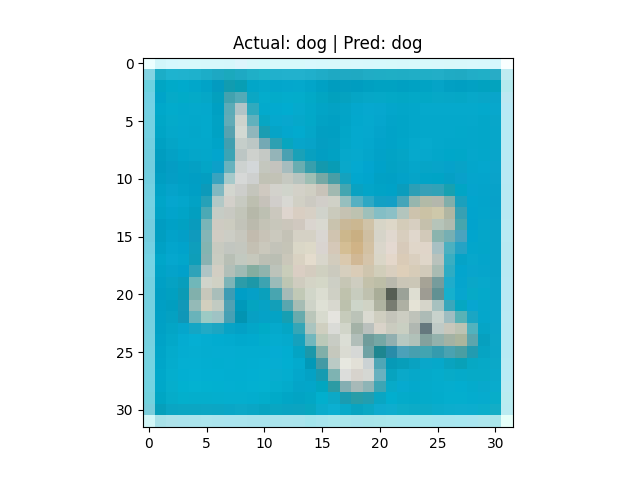
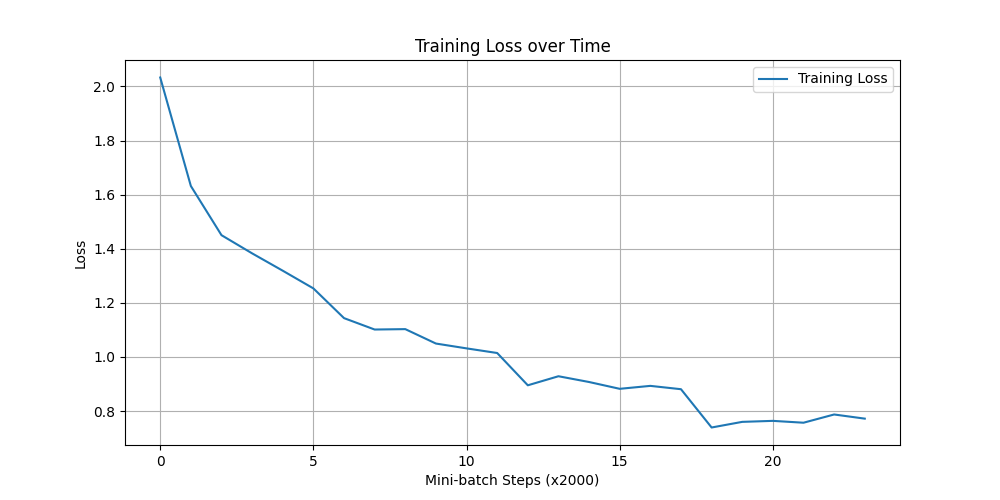

# Mini CNN for CIFAR-10 🖼️

Welcome! This project demonstrates how to build a **Convolutional Neural Network (CNN)** from scratch to classify images.

**Goal**: Teach a computer to look at a small image (32x32 pixels) and correctly identify what is in it (e.g., a **cat** 🐱, a **dog** 🐶, or an **airplane** ✈️).



---

## 🧐 What is this?

This is a **Computer Vision** project using **PyTorch**, a popular AI library.

We use the **CIFAR-10** dataset, which is like the "Hello World" of image recognition. It consists of:
- **60,000 images**
- **10 Classes**: Airplane, Automobile, Bird, Cat, Deer, Dog, Frog, Horse, Ship, Truck.

---

## 🧠 How does the "Brain" work?

Our model (`model.py`) is a **Convolutional Neural Network (CNN)**. Think of it like a human eye + brain processing visual information in steps:

1.  **Input**: The raw image (numbers representing colors).
2.  **Convolutional Layers (The Eyes)**:
    - These layers slide small "filters" over the image to detect features.
    - **Layer 1** might detect simple edges (horizontal lines, vertical lines).
    - **Layer 2** might combine them to detect shapes (circles, corners).
    - *Analogy*: Like looking at the world through different colored glasses to highlight specific things.
3.  **Pooling (The Summary)**:
    - This reduces the image size, keeping only the most important features. It makes the model faster and less sensitive to small movements (e.g., a cat shifting slightly to the left is still a cat).
4.  **Fully Connected Layers (The Brain)**:
    - These layers take all the detected features (shapes, textures) and decide what the object is.
    - It outputs a score for each of the 10 classes. The highest score is the prediction.

---

## 🎓 How did it learn? (Training)

We trained the model using `train.py` for **4 epochs**. Here is the process:

1.  **Guess**: The model looks at a random image and guesses what it is. Initially, it guesses randomly.
2.  **Check**: We compare the guess to the actual answer (Ground Truth).
3.  **Learn (Backpropagation)**: We calculate the "Loss" (error). If it guessed "Cat" but it was a "Dog", we adjust the model's internal numbers (weights) slightly to make "Dog" more likely next time.
4.  **Repeat**: We did this thousands of times until the error became small.

### Training Progress
As the model practices, its error (Loss) goes down.



**Final Accuracy**: ~62-66% (It guesses correct 2 out of 3 times).

---

## 🚀 How to Run It

### 1. Setup
Make sure you have Python installed, then install the required libraries:
```bash
pip install -r requirements.txt
```

### 2. Train the Model (Optional)
I have already set up the training script for you. If you want to retrain it from scratch:
```bash
python train.py
```
*Note: This runs for 4 epochs and uses your GPU (MPS) if available!*

### 3. See Predictions (The Fun Part!)
To see the model in action, run the prediction script. It picks a random test image and shows what the model thinks.
```bash
python predict.py
```

### 4. Visualize Data
To just look at what the raw training images look like:
```bash
python visualize.py
```

---

## 📂 Project Structure

- `model.py`: The architecture of our CNN "brain".
- `train.py`: The teacher script that trains the model.
- `predict.py`: The application script that uses the trained model.
- `visualize.py`: A helper to peek at the dataset.
- `training_plot.png`: Graph showing how loss decreased during training.
- `requirements.txt`: List of dependencies.

---

## 🧪 Experimentation Log

### Experiment 1: Baseline
- **Configuration**: Simple 2-Layer CNN, 2 Epochs.
- **Accuracy**: ~50%.

### Experiment 2: Extended Training & Hardware Acceleration
- **What I Changed**: Increased training epochs from 2 to **20** and enabled **MPS (Metal Performance Shaders)** on Mac.
- **Why I Expected it to Help**: More training time allows the model to see the data more often and minimize the error further. MPS speeds up this process significantly.
- **Result (Partially Successful)**: The training loss dropped significantly (~0.1), but the test accuracy plateaued around **66%**. This indicated the model was **overfitting** (memorizing training data but not generalizing).

### Experiment 3: Optimization
- **What I Changed**: Reduced training to **4 Epochs**.
- **Why I Expected it to Help**: Since accuracy stopped improving early, shorter training saves time without sacrificing performance.
- **Result (Success)**: Achieved similar accuracy (~62-66%) in a fraction of the time.

**Conclusion**: The simple CNN architecture has reached its capacity. To improved beyond 70%, specific architectural changes (like adding Residual connections/ResNet) are needed.
